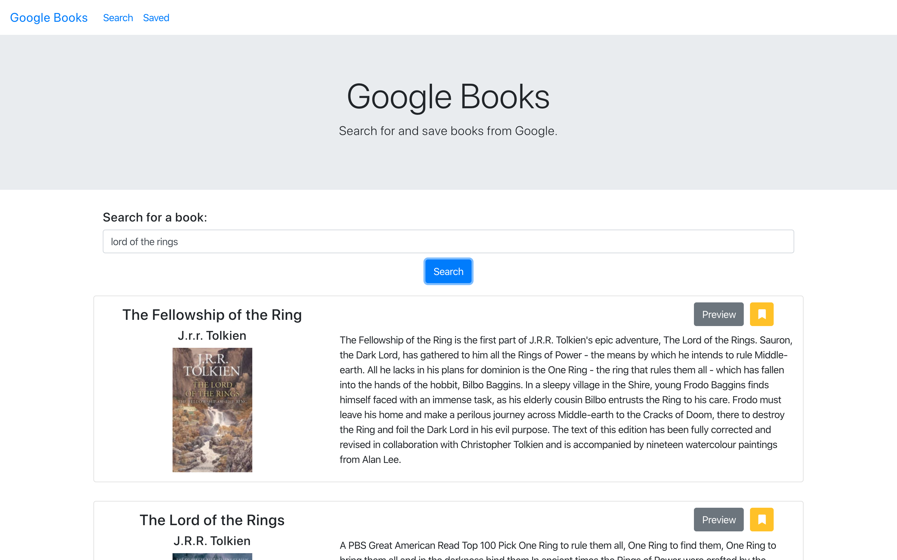
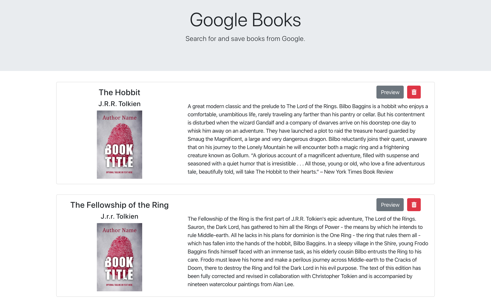

# Google Books Search

## Links to Project

[Live Site](https://g00gleb00ks.herokuapp.com/)  
[GitHub Repository](https://github.com/svivoli/Google-Books-Search)

## Description

A React app that allows users to search, preview, and save books from Google. There are two pages, the home/search page where users search for books and view results and the saved page where the books they save are stored via MongoDB. Saved books can be deleted.

### Modules/Technologies

1. React
2. MongoDB
3. JSX
4. Node

### Website Components

1. Navbar - "Google Books", "Search", "Saved"
2. Jumbotron with site description
3. Home/Search page components:
- Search bar
- Result cards
 - Title, author, thumbnail, description, linked preview button, save button
4. Saved page components:
- Saved cards
 - Title, author, thumbnail, description, linked preview button, delete button
5. Fontawesome icons
6. Bootstrap

## User experience

The home page displays related search results after the user searches for a book by keyword. The user can save a book by clicking the yellow save icon on the respective card of the book they wish to save to their collection.

When the user navigates to the saved page, they will see the books they have saved displayed in cards, just as they are displayed on the search page. Saved books can be removed from their collection by clicking the red delete button on their respective cards.

## Developer Experience

I rather enjoyed writing this app as it required a complex front-end and back-end structure. React is proving to be a useful tool in creating apps that are well structured and recyclable.

--Sarah Vivoli